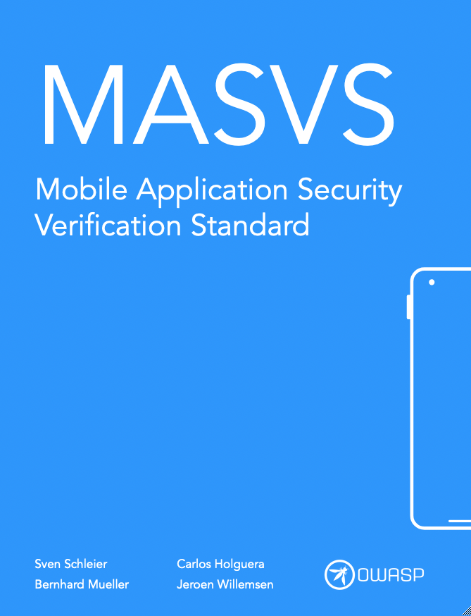
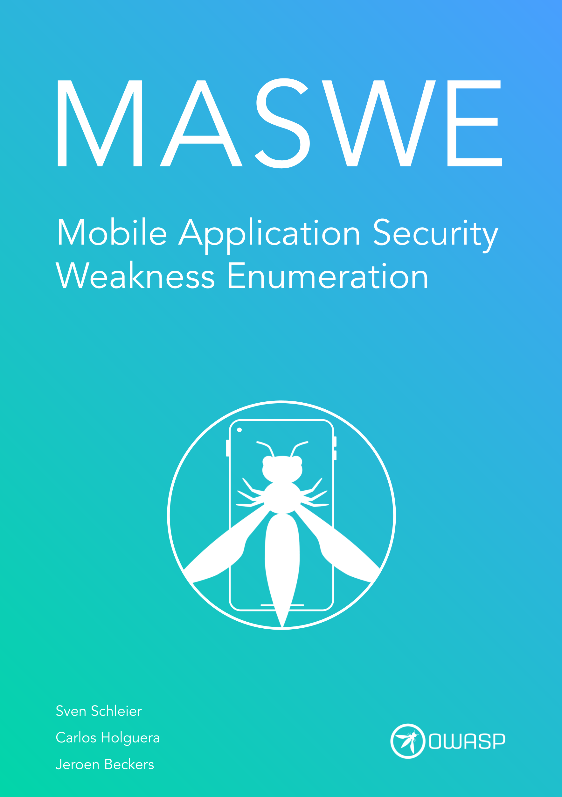
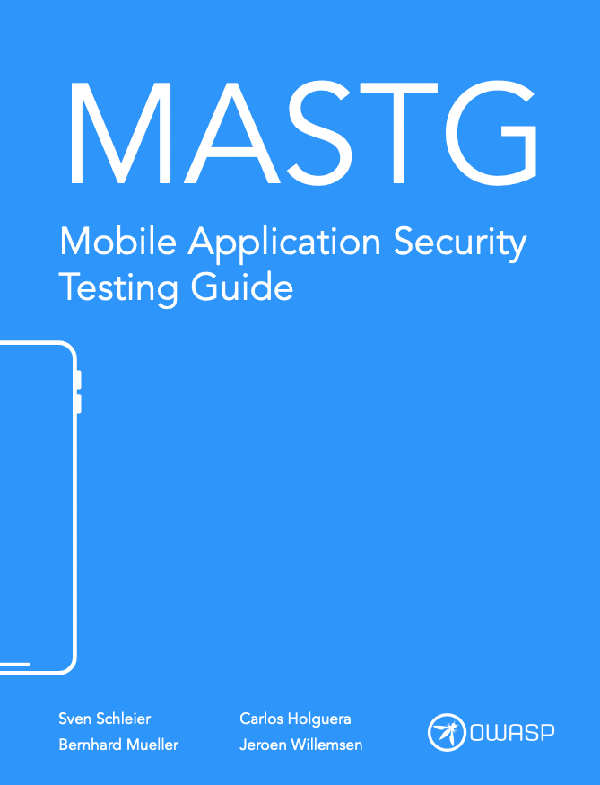

# OWASP Mobile Application Security Project Website

This repository contains the source and configuration for the **OWASP Mobile Application Security Project website** ([mas.owasp.org](https://mas.owasp.org/)).

This website aggregates, organizes, and presents documentation from the main MAS resources using [MkDocs](https://www.mkdocs.org/) and the [mkdocs-material](https://squidfunk.github.io/mkdocs-material/) theme.

Each resource lives in its own GitHub repository:

| Resource | Description | GitHub Repo |
|----------|-------------|-------------|
|  | **MASVS (Mobile Application Security Verification Standard)**   The industry standard for mobile app security requirements. | [OWASP/masvs](https://github.com/OWASP/masvs) |
|  | **MASWE (Mobile Application Security Weakness Enumeration)**   A categorized list of common security and privacy weaknesses in mobile apps. | [OWASP/maswe](https://github.com/OWASP/maswe) |
|  | **MASTG (Mobile Application Security Testing Guide)**   A comprehensive manual for mobile app security testing and reverse engineering. | [OWASP/mastg](https://github.com/OWASP/mastg) |

## Development

The two key components of the repo are:

- The `docs/` directory, which contains all the source files for the website.
- The `mkdocs.yml` file, which configures the MkDocs site.

The site uses a range of MkDocs features and plugins in the `mkdocs.yml` file, including:

- **Material for MkDocs theme** (`theme`) with custom icons, logo, and palette switching (light/dark mode). See [Material for MkDocs documentation](https://squidfunk.github.io/mkdocs-material/) for details.
- **Navigation tabs, sticky tabs, instant navigation, and tracking** (`theme.features`) for improved UX.
- **Search** (`plugins: search`) with suggestions and sharing.
- **Tags** (`plugins: tags`) and **blog** (`plugins: blog`) plugins for dynamic content organization and news posts.
- **Awesome Pages** (`plugins: awesome-pages`) for flexible navigation structure.
- **Redirects plugin** (`plugins: redirects`) with custom Python hooks (`hooks`) for legacy and dynamic page redirects.
- **Custom hooks** (`hooks`) for dynamic content, banners, cross-references, demo buttons, and more.
- **Markdown extensions** (`markdown_extensions`): meta, TOC with permalinks, admonition, tables, fenced code blocks, emoji, progress bars, tabbed content, snippets, and more.
- **Extra CSS/JS** (`extra_css`, `extra_javascript`) for tables, navigation, filtering, and external links.
- **Google Analytics integration** (`extra.analytics`).
- **Copyright and license info** (`copyright`) displayed in the footer.

## Local Development

To build and serve the website locally see [this guide](https://mas.owasp.org/contributing/7_Run_the_Website/).

## Deployment

GitHub Actions build and deploy the site on push to `main` (see `.github/workflows/`).  
The workflow fetches the latest content from the upstream MASTG, MASVS, and MASWE repos before building.

## Contributing

Website improvements, bug fixes, and documentation updates are welcome!
See [our contributing guidelines](https://mas.owasp.org/contributing/) for details.
